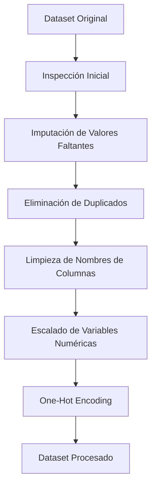

# Pipeline de Preprocesamiento

El pipeline de preprocesamiento se encarga de transformar el dataset original en un formato adecuado para ser utilizado por el modelo de Machine Learning.  
Todo el proceso se ejecuta en el notebook `preprocesamiento.ipynb` y garantiza que los datos estén limpios, consistentes y preparados para el modelado.

---

## 1. Carga y Exploración Inicial

En esta fase se realizan las primeras inspecciones del dataset:

- Carga del archivo desde la carpeta `data/`
- Revisión de la estructura del dataframe (`info()`)
- Identificación de valores faltantes
- Detección de duplicados
- Análisis de los tipos de datos

El objetivo es comprender el estado del dataset antes de aplicar transformaciones.

---

## 2. Tratamiento de Valores Faltantes

Se emplean diferentes estrategias según el tipo de variable:

### 🔹 Variables numéricas  
Se imputan utilizando la **mediana**, ya que es robusta frente a valores atípicos.  
Ejemplo:  
- `Engine HP`

### 🔹 Variables categóricas  
Se imputan con la **moda**, manteniendo las categorías más frecuentes.  
Ejemplo:  
- `Number of Doors`

Estas técnicas evitan la eliminación de filas completas y mantienen la estructura del dataset.

---

## 3. Eliminación de Duplicados

Para evitar sesgos durante el entrenamiento del modelo, se eliminan todas las filas duplicadas:

```python
df = df.drop_duplicates().reset_index(drop=True)
```

## 4. Normalización de nombre de Columnas
```python
df.columns = df.columns.str.strip().str.lower().str.replace(" ", "_")
```
## 5. Escalado de Variables Numéricas

## 6. Codificación de Variables Categóricas
```python
df = pd.get_dummies(df, columns=cat_cols, drop_first=True)
```


